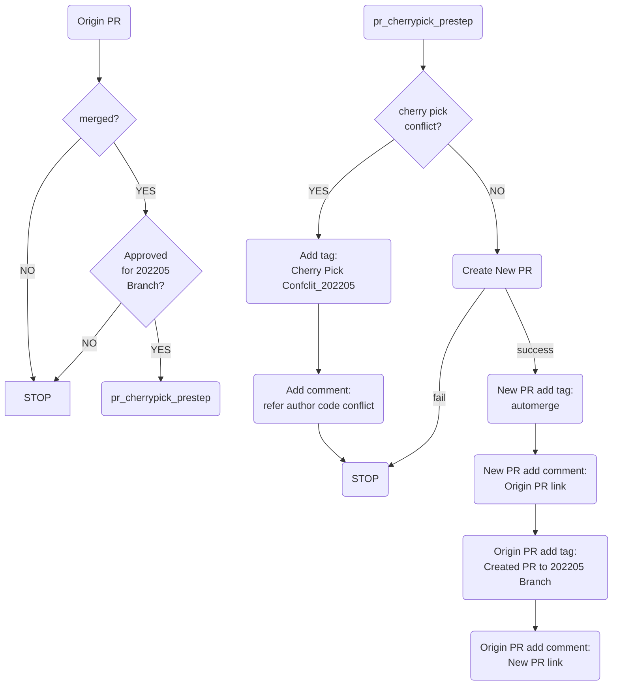
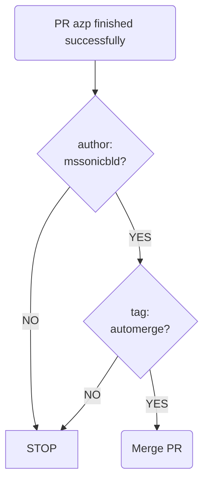
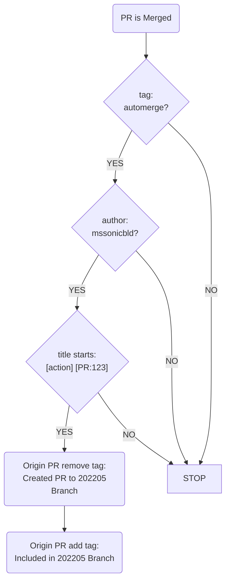
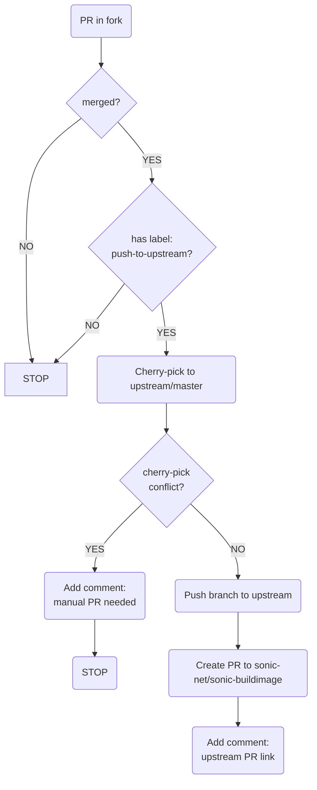

#  Github actions README
This is an introduction about auto-cherry-pick workflow.
take 202205 branch for example:
1. pr_cherrypick_prestep:

2. automerge:

3. pr_cherrypick_poststep:

4. push-to-upstream:

**Prerequisites for push-to-upstream:**
- A GitHub Personal Access Token (PAT) with repo scope stored as `UPSTREAM_TOKEN` secret
- The PAT must have write access to the upstream repository (sonic-net/sonic-buildimage)

**Usage:**
1. Create a PR in this fork
2. Add the `push-to-upstream` label to the PR
3. Merge the PR
4. The workflow will automatically create a PR to the upstream repository
